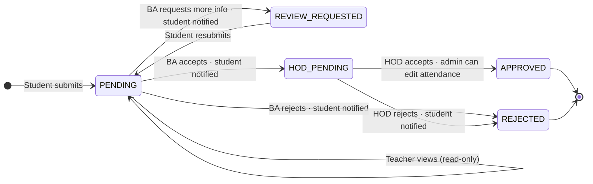
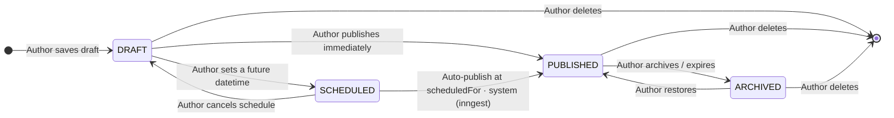
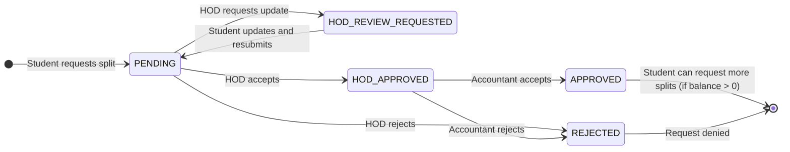
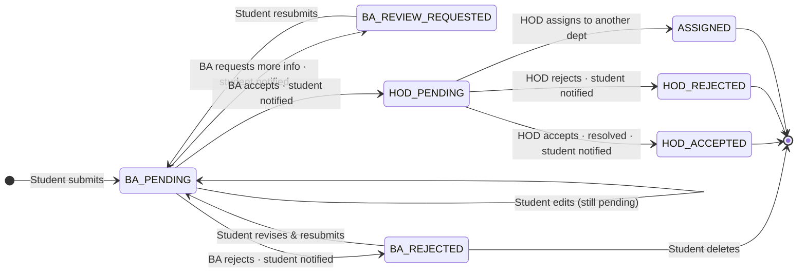

# Modules

## 1. Leave module

Students submit leave requests tied to a specific subject and date. The system rejects duplicates upfront. From there, requests go up a chain of review:

**Security guardrail (Arcjet):** leave-request mutations are rate-limited by fingerprint to **5 requests per 10 minutes** (`fixedWindow`: `max=5`, `window=10m`). This applies to student create/update/delete and reviewer status-update actions.

- **Student** submits form → status: `PENDING`
- **Teacher** sees the leave status inline in the attendance table (read-only)
- **Batch advisor** reviews all requests from their department:
  - Requests more info → `REVIEW_REQUESTED`, student notified with remarks; student updates and resubmits → back to `PENDING`
  - Accepts → forwarded to HOD (`HOD_PENDING`), student notified
  - Rejects → `REJECTED`, student notified
- **HOD** makes the final call:
  - Accepts → `APPROVED`; admin can update attendance retroactively, even if already marked
  - Rejects → `REJECTED`, student notified

**State transition:**



---

## 2. Announcement module

HODs post to their department. Accountants can post portal-wide or to filtered audiences. Students read.

- HOD announcements are scoped to their department only
- Accountant announcements can reach all students across departments (when targeting is left empty) or a filtered subset (department/program/batch/year)
- Announcements can be created immediately or scheduled ahead of time

**State transition:**



---

## 3. Fee installments module _(planned)_

Accountants define a base installment structure (e.g., 70+30 = 95 total). Students can request sequential splits of unpaid installments, with each split creating new installment chunks. Total installment count per student cannot exceed 3. Each split request follows a two-step approval chain (HOD → Accountant).

**Example flow:**

```
Accountant creates:     [70]  +  [25]   = 95 total

Student requests 45 of 70:
  → pays 45 now
  → remaining: 25 (leftover of 70) + 25 (original) = 50
  → HOD + Accountant approve
  Installments now:    [45✓] + [25] + [25] = 3 chunks

Student requests 30 of 50 remaining:
  → pays 30 now
  → remaining: 20
  → HOD + Accountant approve
  Installments now:    [45✓] + [30✓] + [20] ← max reached (3 chunks)

Student pays 20 → done
```

**Flow:**

- **Accountant** pre-defines base installments (e.g., 70+30)
- **Student** can request a split of any unpaid installment → status: `PENDING`
- **HOD** and **Accountant** can both view installment requests in their queues
- **HOD** reviews the split request:
  - Requests update → status: `HOD_REVIEW_REQUESTED`, student notified with remarks (e.g., 40 → 45); student updates and resubmits → status resets to `PENDING`
  - Accepts → forwarded to Accountant (`HOD_APPROVED`)
  - Rejects → status: `REJECTED`, student notified
- **Accountant** makes the final call on HOD-approved requests:
  - Accepts → status: `APPROVED`, installments updated, new vouchers generated
  - Rejects → status: `REJECTED`, student notified
- Paid/approved portions are marked with ✓; student can submit additional split requests until balance is zero

**State transition (per request):**



---

## 4. Complaints module

Students file complaints with a category, description, and an optional attachment. There are two stages of review before anything gets acted on:

- **Student** submits → status: `BA_PENDING`; can edit or delete while in `BA_PENDING`, `BA_REVIEW_REQUESTED`, or `BA_REJECTED`
- **Batch advisor** reviews complaints from their department:
  - Requests more info → `BA_REVIEW_REQUESTED`, remarks added, student notified; student updates and resubmits → back to `BA_PENDING`
  - Accepts → forwarded to HOD (`HOD_PENDING`), student notified
  - Rejects → `BA_REJECTED`, student notified; student can revise & resubmit → back to `BA_PENDING`, or delete permanently
- **HOD** reviews batch-advisor-approved complaints:
  - Accepts → resolved (`HOD_ACCEPTED`), student notified
  - Rejects → `HOD_REJECTED`, student notified
  - Assigns → picks target department and reason; complaint routed with status `ASSIGNED` in receiving department

**State transition:**


