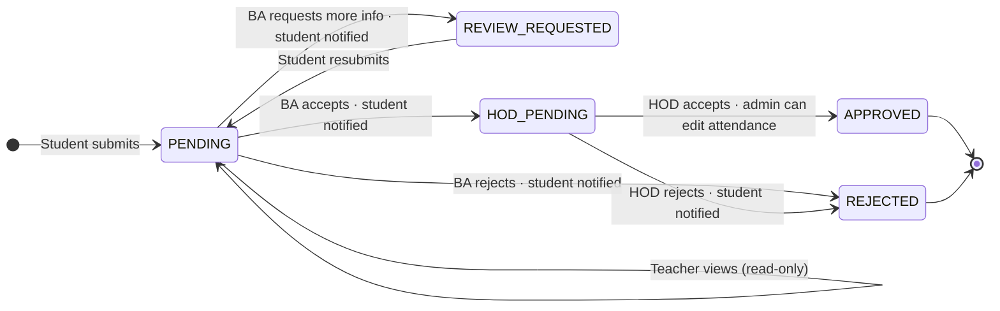
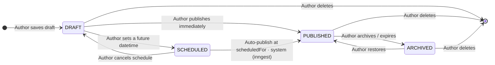
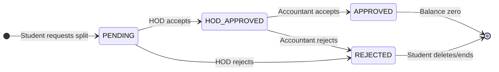
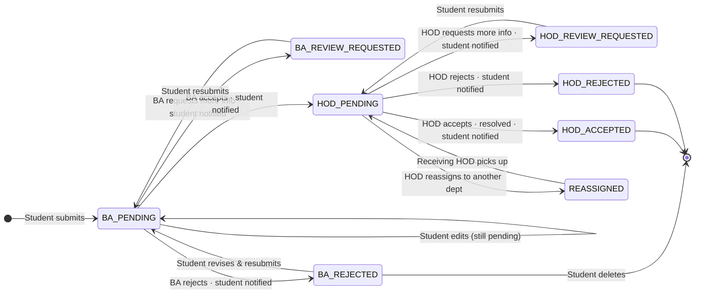

# Modules

## 1. Leave module

Students submit leave requests tied to a specific subject and date. The system rejects duplicates upfront. From there, requests go up a chain of review:

- **Student** submits form → status: `PENDING`
- **Teacher** sees the leave status inline in the attendance table (read-only)
- **Batch advisor** reviews all requests from their department:
  - Requests more info → `REVIEW_REQUESTED`, student notified with remarks; student updates and resubmits → back to `PENDING`
  - Accepts → forwarded to HOD (`HOD_PENDING`), student notified
  - Rejects → `REJECTED`, student notified
- **HOD** makes the final call:
  - Accepts → `APPROVED`; admin can update attendance retroactively, even if already marked
  - Rejects → `REJECTED`, student notified

**State transition:**

---

## 2. Announcement module

HODs post to their department. Accountants post to everyone. Students read.

- HOD announcements are scoped to their department only
- Accountant announcements reach all students across departments
- Announcements can be created immediately or scheduled ahead of time

**State transition:**

---

## 3. Fee installments module

Accountants define a base installment structure (e.g., 70+30). Students can request to further split any due installment, provided the total count doesn't exceed 3. These requests follow a two-step approval chain.

- **Accountant** pre-defines base installments (70+30, etc.)
- **Student** can request a split (e.g., pay 50 of 70) → status: `PENDING`
- **HOD** reviews the split request:
  - Accepts → forwarded to Accountant (`HOD_APPROVED`)
  - Rejects → status: `REJECTED`, student notified
- **Accountant** makes the final call on HOD-approved requests:
  - Accepts → status: `APPROVED`, new vouchers generated
  - Rejects → status: `REJECTED`, student notified

**State transition:**

---

## 4. Complaints module

Students file complaints with a category, description, and an optional attachment. There are two stages of review before anything gets acted on:

- **Student** submits → status: `BA_PENDING`; can edit or delete while in `BA_PENDING`, `BA_REVIEW_REQUESTED`, or `BA_REJECTED`
- **Batch advisor** reviews complaints from their department:
  - Requests more info → `BA_REVIEW_REQUESTED`, remarks added, student notified; student updates and resubmits → back to `BA_PENDING`
  - Accepts → forwarded to HOD (`HOD_PENDING`), student notified
  - Rejects → `BA_REJECTED`, student notified; student can revise & resubmit → back to `BA_PENDING`, or delete permanently
- **HOD** reviews batch-advisor-approved complaints:
  - Requests more info → `HOD_REVIEW_REQUESTED`, remarks added, student notified; student updates and resubmits → back to `HOD_PENDING`
  - Accepts → resolved (`HOD_ACCEPTED`), student notified
  - Rejects → `HOD_REJECTED`, student notified
  - Reassigns → routed to another department (`REASSIGNED`)

**State transition:**

