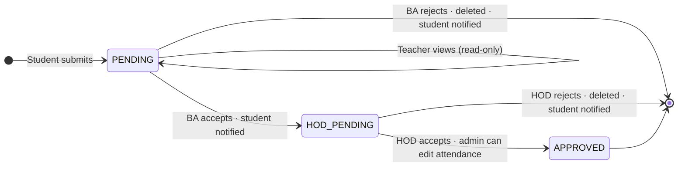
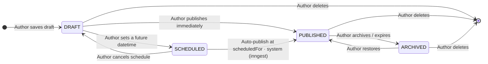
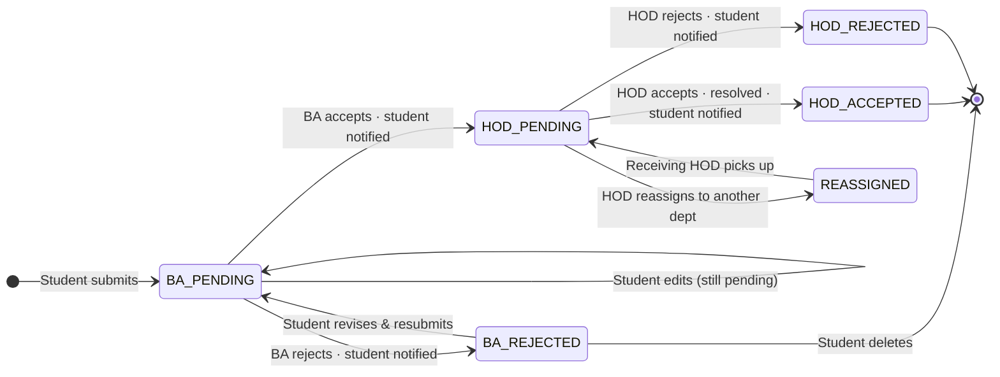

# Modules

## 1. Leave module

Students submit leave requests tied to a specific subject and date. The system rejects duplicates upfront. From there, requests go up a chain of review:

- **Student** submits form → status: `PENDING`
- **Teacher** sees the leave status inline in the attendance table (read-only)
- **Batch advisor** reviews all requests from their department:
  - Accepts → forwarded to HOD, student notified
  - Rejects → deleted, student notified
- **HOD** makes the final call:
  - Accepts → admin can update attendance retroactively, even if already marked
  - Rejects → deleted, student notified

**State transition:**

---

## 2. Announcement module

HODs post to their department. Accountants post to everyone. Students read.

- HOD announcements are scoped to their department only
- Accountant announcements reach all students across departments
- Announcements can be created immediately or scheduled ahead of time

**State transition:**

---

## 3. Fee installments module

Accountants define up to three installments per semester. Students can view theirs, download a PDF voucher on the spot, or submit a request to split payments differently. HODs and accountants review and handle those requests.

> Module not yet implemented — state transitions TBD.

---

## 4. Complaints module

Students file complaints with a category, description, and an optional attachment. There are two stages of review before anything gets acted on:

- **Student** submits → status: `BA_PENDING`
- **Batch advisor** reviews complaints from their department:
  - Accepts → forwarded to HOD (`HOD_PENDING`), student notified
  - Rejects → deleted (`BA_REJECTED`), student notified
- **HOD** reviews batch-advisor-approved complaints:
  - Accepts → resolved (`HOD_ACCEPTED`), student notified
  - Rejects → deleted (`HOD_REJECTED`), student notified
  - Reassigns → routed to another department (`REASSIGNED`)

**State transition:**

