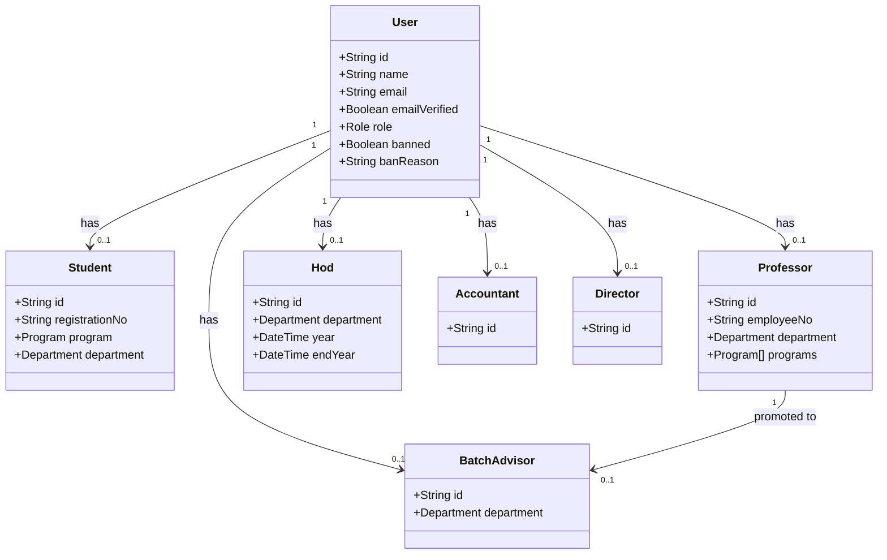
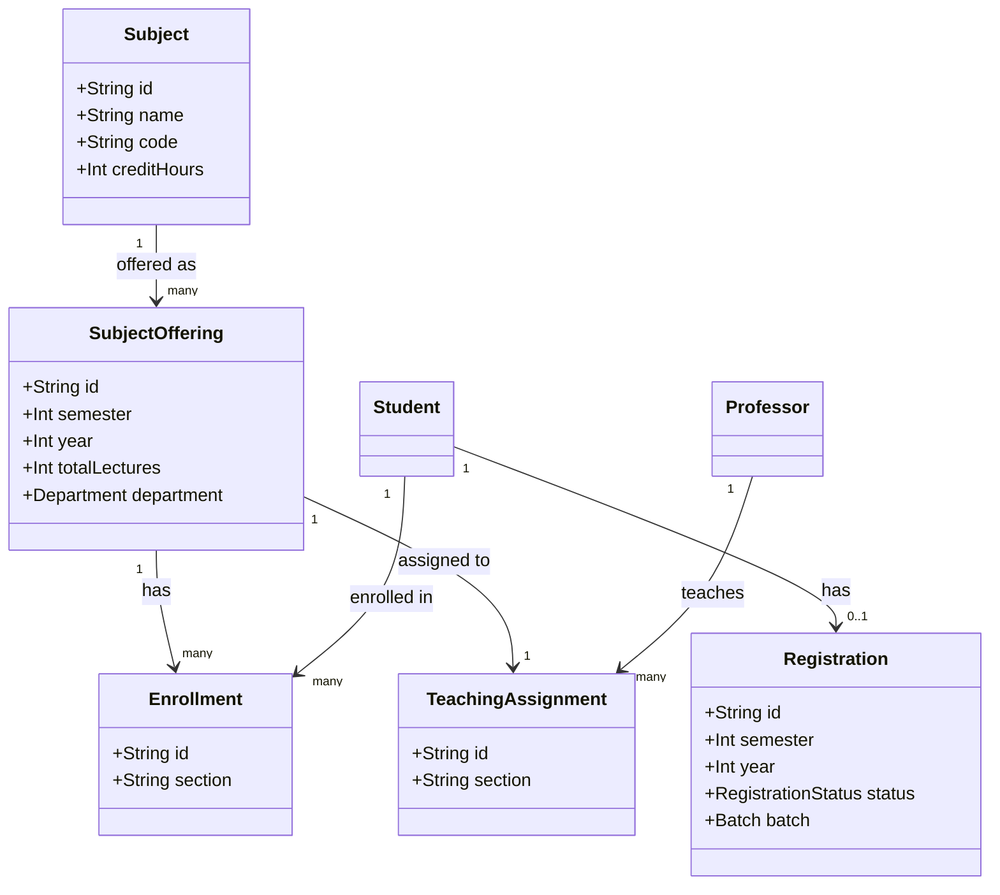
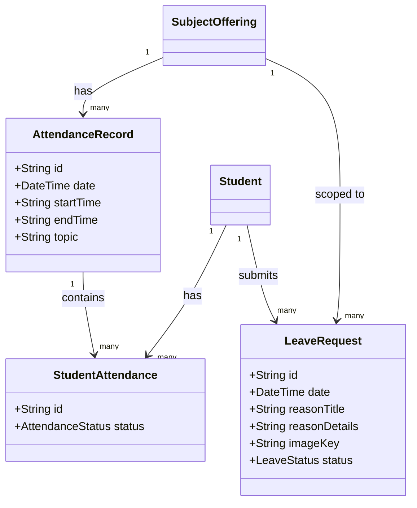
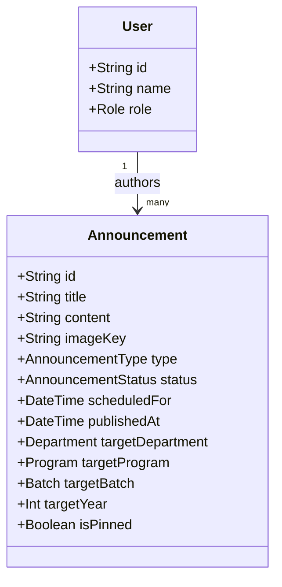
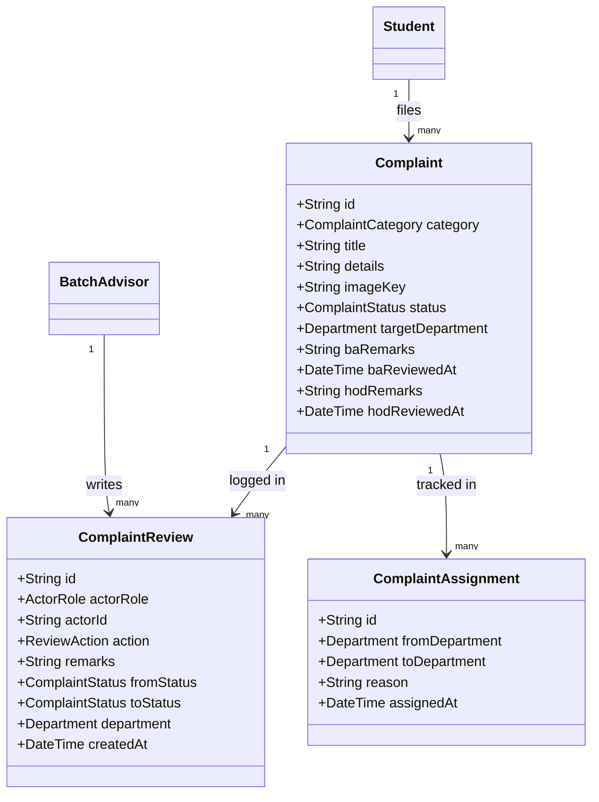
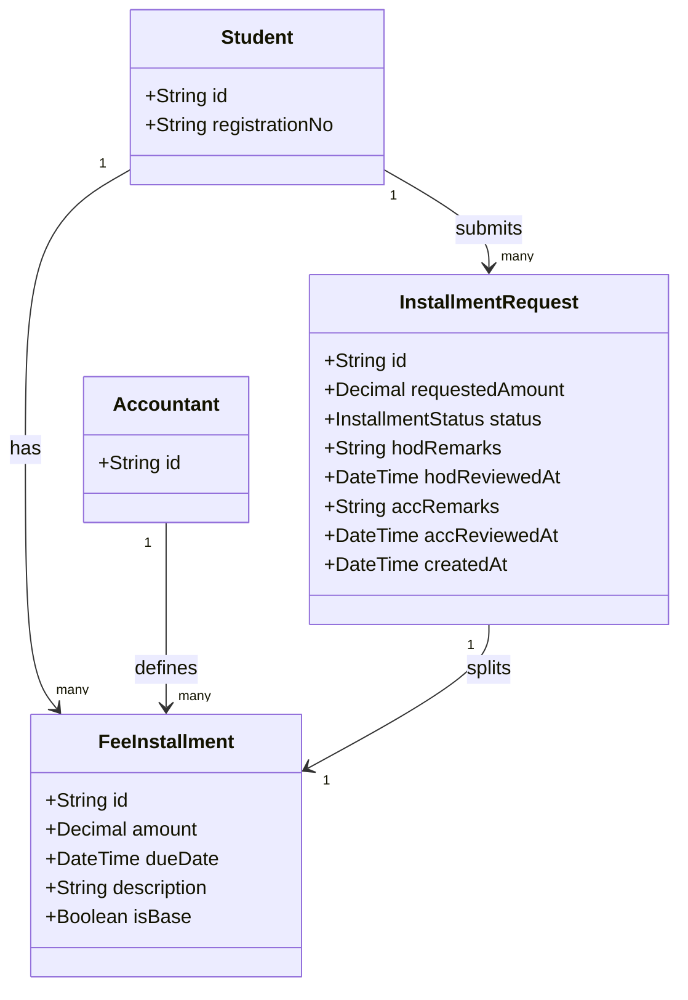

# Class diagrams

## 1. User and roles

**Key classes**

- `User` is the single identity record for every person in the system, regardless of role. It holds auth state (email verified, banned) and a `role` enum that gates which dashboard and permissions apply.
- Each role — `Student`, `Professor`, `Hod`, `BatchAdvisor`, `Accountant`, `Director` — is a separate profile model linked 1:1 to `User`. They hold domain-specific data that only makes sense for that role.

**Relationships**

- `User` has at most one profile per role. Most users have exactly one; a professor who is also a batch advisor has two (`Professor` and `BatchAdvisor` both point to the same `User`).
- `Professor` has a `0..1` link to `BatchAdvisor` — a batch advisor must already be a professor. The BA profile holds the department assignment.

**Responsibilities**

- `User` handles identity, session ownership, and access control. Everything that touches auth reads from this table.
- Role profiles exist to avoid polluting `User` with domain columns. `Student` carries the registration number and department; `Professor` carries the employee number and teaching programs; `Hod` tracks appointment dates; `BatchAdvisor` scopes review queues to a department.

---

## 2. Academic domain

**Key classes**

- `Subject` is the catalogue entry — name, code, credit hours. It exists independently of any semester.
- `SubjectOffering` is a running instance of a subject: a specific semester, year, and department. This is what students enroll in and professors are assigned to.
- `Enrollment` is the join between a student and an offering, with an optional section.
- `TeachingAssignment` is the join between a professor and an offering. One offering has one professor.
- `Registration` tracks a student's formal enrollment application for a semester, with an approval status.

**Relationships**

- `Subject` → `SubjectOffering` is one-to-many: the same subject can run in multiple semesters and departments.
- `SubjectOffering` → `Enrollment` is one-to-many: many students can enroll in the same offering.
- `SubjectOffering` → `TeachingAssignment` is one-to-one: only one professor per offering (enforced by a unique constraint).
- `Student` → `Registration` is one-to-one: a student has one active registration at a time.

**Responsibilities**

- `SubjectOffering` is the central join point for the academic domain. Attendance records, enrollments, teaching assignments, and leave requests all hang off it.
- `Registration` drives the semester onboarding flow — a student's enrollment is not valid until their registration is approved.
- `TeachingAssignment` determines which professor sees which leave requests and attendance tables.

---

## 3. Attendance and leave

**Key classes**

- `AttendanceRecord` captures a single lecture — date, time window, and topic. One record per class session per offering.
- `StudentAttendance` is the per-student row inside a record. Status is `PRESENT`, `ABSENT`, or `LEAVE`.
- `LeaveRequest` is the student's formal request to have an absence counted as leave. It references the offering and the specific date, not the attendance record directly.

**Relationships**

- `AttendanceRecord` → `StudentAttendance` is one-to-many: one lecture record fans out to one attendance row per enrolled student.
- `Student` → `LeaveRequest` is one-to-many. The unique constraint on `(studentId, offeringId, date)` prevents duplicate requests for the same class.
- `LeaveRequest` is scoped to a `SubjectOffering`, not an `AttendanceRecord` — leave can be requested before a record even exists for that date.

**Responsibilities**

- `AttendanceRecord` is the professor's write surface — they create it per lecture and mark each student.
- `StudentAttendance` is what the percentage calculation and at-risk logic reads from.
- `LeaveRequest` drives the approval workflow. Status flows `PENDING` → (optionally `REVIEW_REQUESTED` if BA needs more info, back to `PENDING` on resubmit) → `HOD_PENDING` → `APPROVED` or `REJECTED`. When approved, admin can go back and flip the corresponding `StudentAttendance` status from `ABSENT` to `LEAVE`.

---

## 4. Announcements

**Key classes**

- `Announcement` holds everything: content, lifecycle status, audience targeting fields, and scheduling metadata. It is self-contained — no child tables.
- `User` is the author. Both HODs and accountants create announcements; the role on the author determines the default scoping rules enforced in the action layer.

**Relationships**

- `User` → `Announcement` is one-to-many. One author can have many announcements; each announcement belongs to one author.
- There are no student-facing join tables — audience matching is done at query time by filtering on `targetDepartment`, `targetProgram`, `targetBatch`, and `targetYear` against the reading student's profile.

**Responsibilities**

- `Announcement` owns the full lifecycle: `DRAFT` → `SCHEDULED` → `PUBLISHED` → `ARCHIVED`. The `scheduledFor` field is what the inngest background job reads to know when to flip status to `PUBLISHED`.
- `isPinned` surfaces urgent announcements at the top of the student feed without a separate model.
- All four targeting columns being nullable means a single model covers every audience scope — department-only (HOD), portal-wide (accountant), or any filtered subset.

---

## 5. Complaints

**Key classes**

- `Complaint` is the core record. It carries the current `status`, the active `targetDepartment` (which changes on reassignment), and the remarks left by each reviewer.
- `ComplaintReview` is an append-only audit log. Every action taken by any actor — student, BA, or HOD — creates one row with a `fromStatus` and `toStatus`. This makes the full timeline reconstructable without guessing from status history.
- `ComplaintAssignment` is a separate append-only log specifically for department routing events. Each reassignment creates one row, recording where it came from and where it went.

**Relationships**

- `Complaint` → `ComplaintReview` is one-to-many. A complaint accumulates review entries over its lifetime — submission, BA decision, HOD decision, reassignments.
- `Complaint` → `ComplaintAssignment` is one-to-many. Most complaints have zero assignments; reassigned ones have one per hop.
- `BatchAdvisor` → `ComplaintReview` is one-to-many via the optional `batchAdvisorId` FK, which lets a BA pull their own review history independently of any specific complaint.

**Responsibilities**

- `Complaint` owns current state. It is the record that gets updated on each transition. Status flows `BA_PENDING` → (optionally `BA_REVIEW_REQUESTED` if BA needs more info, back to `BA_PENDING` on resubmit) → `HOD_PENDING` → `HOD_ACCEPTED`, `HOD_REJECTED`, or `ASSIGNED` (when HOD routes to another department). Students may edit or delete the complaint while it remains in `BA_PENDING`, `BA_REVIEW_REQUESTED`, or `BA_REJECTED`.
- `ComplaintReview` owns history. Nothing in `ComplaintReview` is ever updated — only inserted. The timeline UI reads from this table, not from `Complaint`. Every state transition — including each `REVIEW_REQUESTED` cycle and each student resubmission — creates one immutable row so the full back-and-forth is reconstructable.

---

## 6. Fee installments

**Key classes**

- `FeeInstallment` represents a single payment block. `isBase` flags whether it was part of the initial plan set by the Accountant or a result of a split request.
- `InstallmentRequest` tracks the student's request to split an existing `FeeInstallment`. It follows the dual-approval chain (HOD → Accountant).

**Relationships**

- `Student` → `FeeInstallment` is one-to-many. A student typically has 2-3 active installments per semester.
- `InstallmentRequest` → `FeeInstallment` is one-to-one; it targets a specific due installment to be broken down.
- `Accountant` → `FeeInstallment` reflects the authorship of the base fee structure.

**Responsibilities**

- `FeeInstallment` is the source of truth for vouchers and balance checks.
- `InstallmentRequest` manages the lifecycle of a custom split. Once approved, the original `FeeInstallment` records are updated or replaced to reflect the new split amount and remaining balance.
