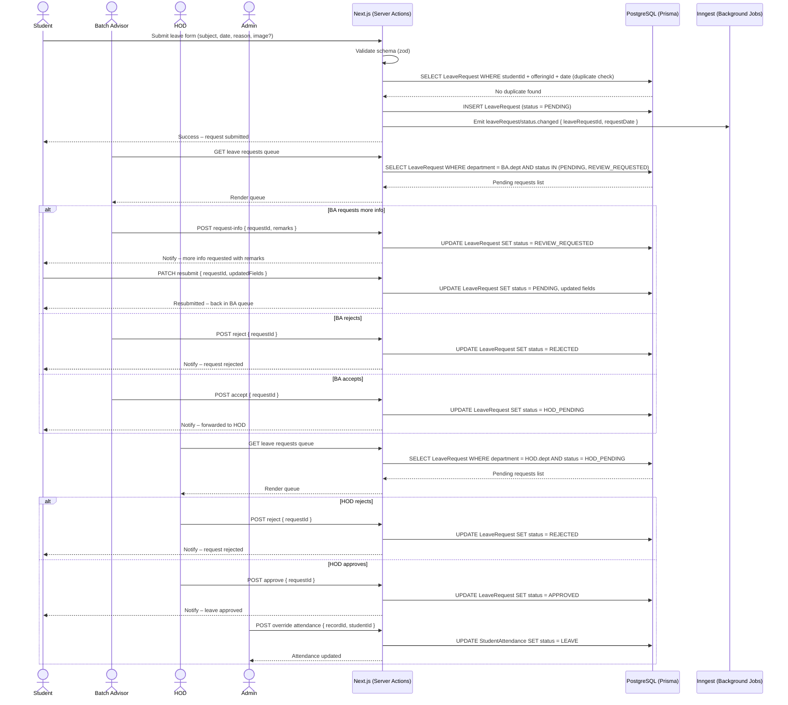
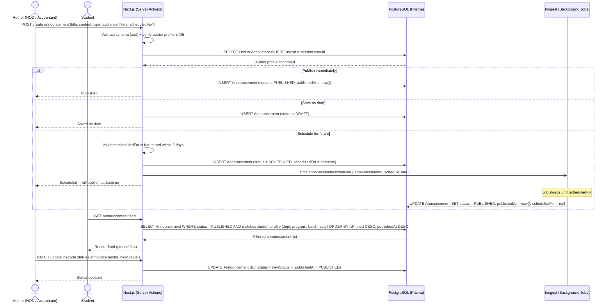
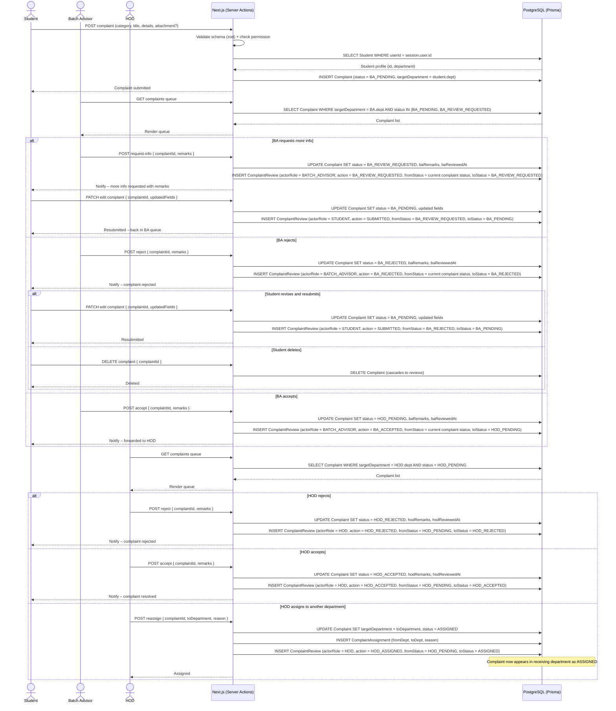
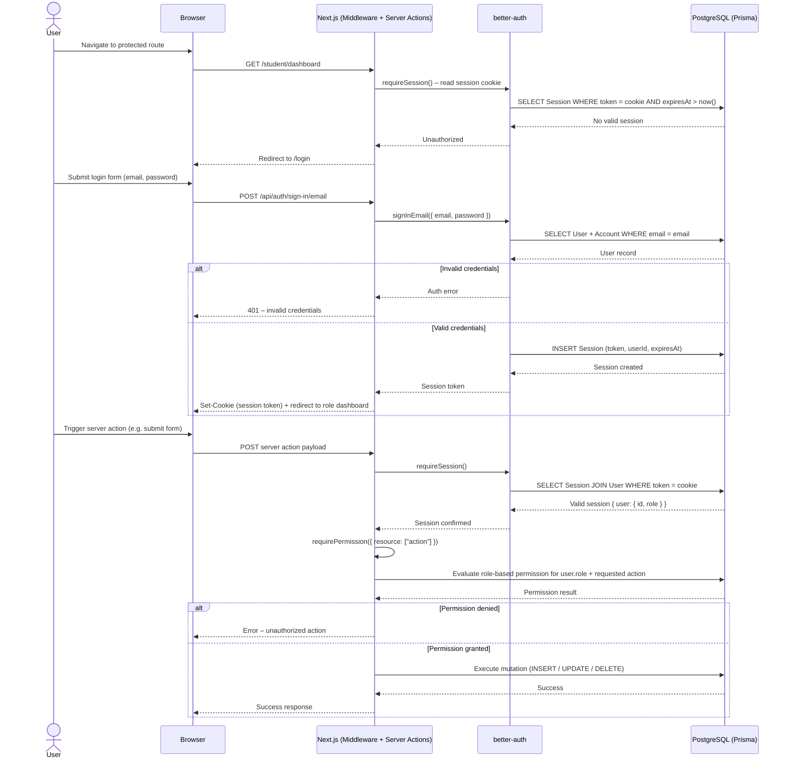

# Sequence diagrams

Sequence diagrams show interaction between actors and system components over time. Each diagram includes the actor on the left, the request-response flow through Next.js server actions, and database/API interactions.

---

## 1. Leave request



**Actors:** Student, Batch Advisor, HOD, Admin
**System components:** Next.js server actions, PostgreSQL via Prisma, Inngest background jobs
**Key interactions:**

- Student submits → Portal validates and duplicate-checks against DB before inserting
- Arcjet runs before mutation logic (fingerprint-based fixed-window `max=5`, `window=10m`); denied requests stop before DB writes
- Inngest fires at submission and sleeps until the request date — auto-rejects if no human has acted
- BA can request more info before making a decision — sets status to `REVIEW_REQUESTED`; student resubmits and request resets to `PENDING`
- BA and HOD each query their own department slice; status gates which queue the request appears in
- Admin attendance override only becomes available after HOD approval — it writes directly to `StudentAttendance`

---

## 2. Announcement



**Actors:** Author (HOD or Accountant), Student
**System components:** Next.js server actions, PostgreSQL via Prisma, Inngest background jobs
**Key interactions:**

- Author profile is verified against DB on every write — HOD gets department auto-scoped, Accountant sets targeting manually
- Three publish paths branch at creation: immediate, draft, or scheduled
- Inngest sleeps between scheduling and publish time; no polling — it wakes at exactly `scheduledFor`
- Student feed query filters by all four targeting columns at once; `null` columns match any value, so portal-wide announcements require no special handling

---

## 3. Fee installments _(planned)_

```mermaid
sequenceDiagram
    actor Accountant
    actor Student
    actor HOD
    participant Portal as Next.js (Server Actions)
    participant DB as PostgreSQL (Prisma)
    participant PDF as PDF Generator

    Accountant->>Portal: POST create base installments (e.g., 70 + 25, each with amount + due date)
    Portal->>Portal: Validate schema (zod)
    Portal->>DB: INSERT FeeInstallment (isBase = true)
    Portal-->>Accountant: Base installments created – [70] + [25] = 95 total

    Student->>Portal: GET my installments
    Portal->>DB: SELECT FeeInstallment WHERE studentId = :studentId AND semester = current
    DB-->>Portal: Installment list
    Portal-->>Student: Render installments (or ✓ if paid)

    Student->>Portal: Click Print voucher { installmentId }
    Portal->>DB: SELECT FeeInstallment + Student details
    DB-->>Portal: Data for voucher
    Portal->>PDF: Generate PDF voucher
    PDF-->>Portal: PDF stream
    Portal-->>Student: Download generated PDF

    Student->>Portal: POST split request (installmentId, requestedAmount, reason)
    Portal->>Portal: Validate: total installments will not exceed 3
    Portal->>DB: INSERT InstallmentRequest (status = PENDING)
    Portal-->>Student: Request submitted – "Requesting 45 of 70"

    Accountant->>Portal: GET installment requests queue (view-only)
    Portal->>DB: SELECT InstallmentRequest WHERE status IN (PENDING, HOD_APPROVED)
    DB-->>Portal: Request list
    Portal-->>Accountant: Render queue (PENDING shown read-only until HOD decision)

    HOD->>Portal: GET installment requests queue
    Portal->>DB: SELECT InstallmentRequest WHERE status = PENDING AND targetDepartment = HOD.dept
    DB-->>Portal: Request list
    Portal-->>HOD: Render queue

    alt HOD rejects
        HOD->>Portal: POST reject { requestId, hodRemarks }
        Portal->>DB: UPDATE InstallmentRequest SET status = REJECTED, hodRemarks
        Portal-->>Student: Notify – request rejected
    else HOD requests update
        HOD->>Portal: POST request-update { requestId, suggestedAmount: 45, hodRemarks }
        Portal->>DB: UPDATE InstallmentRequest SET status = HOD_REVIEW_REQUESTED, hodRemarks
        Portal-->>Student: Notify – "Update requested: adjust amount from 40 to 45"
        Student->>Portal: POST update request { requestId, requestedAmount: 45, reason }
        Portal->>DB: UPDATE InstallmentRequest SET requestedAmount = 45, status = PENDING
        Portal-->>HOD: Updated request returned to HOD queue
    else HOD accepts
        HOD->>Portal: POST accept { requestId }
        Portal->>DB: UPDATE InstallmentRequest SET status = HOD_APPROVED, hodReviewedAt
        Portal-->>HOD: Request forwarded to Accountant

        Accountant->>Portal: GET HOD-approved requests queue
        Portal->>DB: SELECT InstallmentRequest WHERE status = HOD_APPROVED
        DB-->>Portal: Request list
        Portal-->>Accountant: Render queue

        alt Accountant rejects
            Accountant->>Portal: POST reject { requestId, accRemarks }
            Portal->>DB: UPDATE InstallmentRequest SET status = REJECTED, accRemarks
            Portal-->>Student: Notify – request rejected
        else Accountant accepts
            Accountant->>Portal: POST approve { requestId }
            Portal->>DB: UPDATE InstallmentRequest SET status = APPROVED, accReviewedAt
            Portal->>DB: INSERT NEW FeeInstallment (isBase = false) for approved amount (45) – marked ✓
            Portal->>DB: UPDATE original FeeInstallment to reflect remaining balance
            Portal->>DB: INSERT FeeInstallment for new unpaid chunk (25 leftover + 25 original = 50 remaining)
            Portal-->>Student: Notify – split approved · Installments now: [45✓] + [25] + [25]
            Portal->>PDF: Generate new set of vouchers
            PDF-->>Portal: PDF streams
            Portal-->>Student: New vouchers ready for download
        end

        Student->>Portal: POST another split request (if balance > 0)
        Student-->>Portal: "Requesting 30 of 50 remaining"
        Portal->>DB: INSERT InstallmentRequest (status = PENDING) for second request
        Portal-->>Student: Second request submitted

        Note over HOD,Portal: HOD and Accountant repeat approval for second request
        Portal->>DB: INSERT FeeInstallment for approved amount (30) – marked ✓
        Portal->>DB: UPDATE to reflect remaining 20
        Portal-->>Student: Notify – Installments now: [45✓] + [30✓] + [20] (limit reached)

        Student->>Portal: Pays final 20 offline/via system
        Portal->>DB: UPDATE FeeInstallment SET status = PAID
        Portal-->>Student: Installment complete
    end
        Portal-->>Student: Notify – new installment plan applied
    end
```

**Actors:** Accountant, Student, Reviewer (HOD or Accountant)
**System components:** Next.js server actions, PostgreSQL via Prisma, PDF generator
**Key interactions:**

- Accountant writes installments once per semester; all enrolled students read the same records
- PDF generation is on-demand at download time — no pre-generation or storage
- Student split requests land in a shared review queue for both HOD and Accountant
- Approval triggers two DB writes: the request status update and the actual installment record update

---

## 4. Complaint



**Actors:** Student, Batch Advisor, HOD
**System components:** Next.js server actions, PostgreSQL via Prisma
**Key interactions:**

- Student's department is read from DB at submission — `targetDepartment` is never sent by the client
- Every state transition writes two DB rows in a transaction: the `Complaint` update and a `ComplaintReview` audit entry
- BA can request more info before deciding — sets status to `BA_REVIEW_REQUESTED`; student resubmits and status resets to `BA_PENDING`
- HOD decisions are terminal (`HOD_ACCEPTED` / `HOD_REJECTED`) unless assigned to another department
- Assignment writes three rows: `Complaint` update, `ComplaintAssignment` log, `ComplaintReview` entry — complaint lands in receiving department as `ASSIGNED`
- The `BA_REJECTED → BA_PENDING` resubmit loop also creates a review entry so the full edit history is preserved

---

## 5. Authentication and access control



**Actors:** User (any role)
**System components:** Next.js middleware and server actions, better-auth, PostgreSQL via Prisma
**Key interactions:**

- Every protected route hits `requireSession` before any logic runs — unauthenticated requests never reach DB queries or mutations
- Login flow goes through better-auth which owns credential validation and session creation; the portal never handles raw passwords
- `requirePermission` runs after session validation on every server action — it checks the user's role against the specific resource and action being requested, not just a generic role gate
- Admin role changes take effect on the next request after the user record is updated; the current session is not invalidated, but the re-read role on the next `requireSession` call reflects the change
