# Entity relationship diagram

```mermaid
erDiagram

    %% ── USER & AUTH ──────────────────────────────────────────────────────────────

    USER {
        string id PK
        string name
        string email UK
        boolean emailVerified
        string image
        string role
        boolean banned
        string banReason
        datetime banExpires
        datetime createdAt
        datetime updatedAt
    }

    SESSION {
        string id PK
        string token UK
        string userId FK
        datetime expiresAt
        string ipAddress
        string userAgent
        string impersonatedBy
        datetime createdAt
        datetime updatedAt
    }

    ACCOUNT {
        string id PK
        string userId FK
        string providerId
        string accountId
        string password
        string scope
        datetime accessTokenExpiresAt
        datetime refreshTokenExpiresAt
        datetime createdAt
        datetime updatedAt
    }

    VERIFICATION {
        string id PK
        string identifier
        string value
        datetime expiresAt
        datetime createdAt
        datetime updatedAt
    }

    %% ── ROLE PROFILES ────────────────────────────────────────────────────────────

    STUDENT {
        string id PK
        string userId FK
        string registrationNo UK
        string program
        string department
        datetime createdAt
        datetime updatedAt
    }

    PROFESSOR {
        string id PK
        string userId FK
        string employeeNo UK
        string department
        datetime createdAt
        datetime updatedAt
    }

    HOD {
        string id PK
        string userId FK
        string department UK
        datetime year
        datetime endYear
        datetime createdAt
        datetime updatedAt
    }

    BATCH_ADVISOR {
        string id PK
        string userId FK
        string professorId FK
        string department UK
        datetime appointedAt
        datetime createdAt
        datetime updatedAt
    }

    ACCOUNTANT {
        string id PK
        string userId FK
        datetime createdAt
        datetime updatedAt
    }

    DIRECTOR {
        string id PK
        string userId FK
        datetime createdAt
        datetime updatedAt
    }

    %% ── ACADEMIC ─────────────────────────────────────────────────────────────────

    SUBJECT {
        string id PK
        string name
        string code UK
        int creditHours
        datetime createdAt
        datetime updatedAt
    }

    SUBJECT_OFFERING {
        string id PK
        string subjectId FK
        int semester
        int year
        int totalLectures
        string department
        datetime createdAt
        datetime updatedAt
    }

    ENROLLMENT {
        string id PK
        string studentId FK
        string offeringId FK
        string section
        datetime createdAt
        datetime updatedAt
    }

    TEACHING_ASSIGNMENT {
        string id PK
        string professorId FK
        string offeringId FK
        string section
        datetime createdAt
        datetime updatedAt
    }

    REGISTRATION {
        string id PK
        string studentId FK
        int semester
        int year
        string status
        string batch
        datetime createdAt
        datetime updatedAt
    }

    %% ── ATTENDANCE & LEAVE ───────────────────────────────────────────────────────

    ATTENDANCE_RECORD {
        string id PK
        string offeringId FK
        datetime date
        string startTime
        string endTime
        string topic
        datetime createdAt
        datetime updatedAt
    }

    STUDENT_ATTENDANCE {
        string id PK
        string recordId FK
        string studentId FK
        string status
        datetime createdAt
        datetime updatedAt
    }

    LEAVE_REQUEST {
        string id PK
        string studentId FK
        string offeringId FK
        datetime date
        string reasonTitle
        string reasonDetails
        string imageKey
        string status
        datetime createdAt
        datetime updatedAt
    }

    %% ── ANNOUNCEMENTS ────────────────────────────────────────────────────────────

    ANNOUNCEMENT {
        string id PK
        string authorId FK
        string title
        string content
        string imageKey
        string type
        string status
        boolean isPinned
        datetime scheduledFor
        datetime publishedAt
        string targetDepartment
        string targetProgram
        string targetBatch
        int targetYear
        datetime createdAt
        datetime updatedAt
    }

    %% ── COMPLAINTS ───────────────────────────────────────────────────────────────

    COMPLAINT {
        string id PK
        string studentId FK
        string batchAdvisorId FK
        string category
        string title
        string details
        string imageKey
        string status
        string targetDepartment
        string baRemarks
        datetime baReviewedAt
        string hodRemarks
        datetime hodReviewedAt
        datetime createdAt
        datetime updatedAt
    }

    %% ── FEE INSTALLMENTS ──────────────────────────────────────────────────────────

    FEE_INSTALLMENT {
        string id PK
        string studentId FK
        string accountantId FK
        decimal amount
        datetime dueDate
        string description
        boolean isBase
        datetime createdAt
        datetime updatedAt
    }

    INSTALLMENT_REQUEST {
        string id PK
        string installmentId FK
        decimal requestedAmount
        string status
        string hodRemarks
        datetime hodReviewedAt
        string accRemarks
        datetime accReviewedAt
        datetime createdAt
        datetime updatedAt
    }

    %% ── TRANSACTION & LOG ────────────────────────────────────────────────────────

    COMPLAINT_REVIEW {
        string id PK
        string complaintId FK
        string batchAdvisorId FK
        string actorRole
        string actorId
        string action
        string remarks
        string fromStatus
        string toStatus
        string department
        datetime createdAt
    }

    COMPLAINT_ASSIGNMENT {
        string id PK
        string complaintId FK
        string fromDepartment
        string toDepartment
        string reason
        datetime assignedAt
    }

    %% ── RELATIONSHIPS ────────────────────────────────────────────────────────────

    USER ||--o{ SESSION : "1:N"
    USER ||--o{ ACCOUNT : "1:N"
    USER ||--o| STUDENT : "1:1"
    USER ||--o| PROFESSOR : "1:1"
    USER ||--o| HOD : "1:1"
    USER ||--o| BATCH_ADVISOR : "1:1"
    USER ||--o| ACCOUNTANT : "1:1"
    USER ||--o| DIRECTOR : "1:1"
    USER ||--o{ ANNOUNCEMENT : "1:N"

    PROFESSOR ||--o| BATCH_ADVISOR : "1:1"

    SUBJECT ||--o{ SUBJECT_OFFERING : "1:N"
    SUBJECT_OFFERING ||--o{ ENROLLMENT : "1:N"
    SUBJECT_OFFERING ||--o| TEACHING_ASSIGNMENT : "1:1"
    SUBJECT_OFFERING ||--o{ ATTENDANCE_RECORD : "1:N"
    SUBJECT_OFFERING ||--o{ LEAVE_REQUEST : "1:N"

    STUDENT ||--o{ ENROLLMENT : "1:N"
    STUDENT ||--o| REGISTRATION : "1:1"
    STUDENT ||--o{ STUDENT_ATTENDANCE : "1:N"
    STUDENT ||--o{ LEAVE_REQUEST : "1:N"
    STUDENT ||--o{ COMPLAINT : "1:N"

    PROFESSOR ||--o{ TEACHING_ASSIGNMENT : "1:N"

    ATTENDANCE_RECORD ||--|{ STUDENT_ATTENDANCE : "1:N"

    BATCH_ADVISOR ||--o{ COMPLAINT : "1:N"
    BATCH_ADVISOR ||--o{ COMPLAINT_REVIEW : "1:N"

    COMPLAINT ||--o{ COMPLAINT_REVIEW : "1:N"
    COMPLAINT ||--o{ COMPLAINT_ASSIGNMENT : "1:N"

    STUDENT ||--o{ FEE_INSTALLMENT : "1:N"
    ACCOUNTANT ||--o{ FEE_INSTALLMENT : "1:N"
    FEE_INSTALLMENT ||--o| INSTALLMENT_REQUEST : "1:1"
```

---

## Entity categories

### User entity

| Table          | PK   | Key FKs         | Purpose                                                                                             |
| -------------- | ---- | --------------- | --------------------------------------------------------------------------------------------------- |
| `user`         | `id` | —               | Central identity record for every person in the system. Holds auth state, role enum, and ban flags. |
| `session`      | `id` | `userId → user` | Active login sessions managed by better-auth. One user can have many concurrent sessions.           |
| `account`      | `id` | `userId → user` | OAuth provider credentials and tokens. Supports multiple providers per user.                        |
| `verification` | `id` | —               | Time-limited tokens for email verification flows. No FK — keyed by `identifier` (email).            |

---

### Core functional entities

**Role profiles** — each is a 1:1 extension of `user`, holding only the columns relevant to that role.

| Table           | PK   | Key FKs                                    | Unique Constraints                                                  |
| --------------- | ---- | ------------------------------------------ | ------------------------------------------------------------------- |
| `student`       | `id` | `userId → user`                            | `userId`, `registrationNo`                                          |
| `professor`     | `id` | `userId → user`                            | `userId`, `employeeNo`                                              |
| `hod`           | `id` | `userId → user`                            | `userId`, `department` — one HOD per department                     |
| `batch_advisor` | `id` | `userId → user`, `professorId → professor` | `userId`, `department`, `professorId` — must already be a professor |
| `accountant`    | `id` | `userId → user`                            | `userId`                                                            |
| `director`      | `id` | `userId → user`                            | `userId`                                                            |

**Academic domain**

| Table                 | PK   | Key FKs                                                    | Unique Constraints                                  | Cardinality                                      |
| --------------------- | ---- | ---------------------------------------------------------- | --------------------------------------------------- | ------------------------------------------------ |
| `subject`             | `id` | —                                                          | `code`                                              | —                                                |
| `subject_offering`    | `id` | `subjectId → subject`                                      | `(subjectId, semester, year, department)`           | Subject 1:N Offering                             |
| `enrollment`          | `id` | `studentId → student`, `offeringId → subject_offering`     | `(studentId, offeringId)`                           | Student M:N Offering via this table              |
| `teaching_assignment` | `id` | `professorId → professor`, `offeringId → subject_offering` | `(offeringId)` — one professor per offering         | Professor M:N Offering, but offering side is 1:1 |
| `registration`        | `id` | `studentId → student`                                      | `(studentId)` — one active registration per student | Student 1:1 Registration                         |

**Attendance and leave**

| Table                | PK   | Key FKs                                                | Unique Constraints              | Cardinality               |
| -------------------- | ---- | ------------------------------------------------------ | ------------------------------- | ------------------------- |
| `attendance_record`  | `id` | `offeringId → subject_offering`                        | —                               | Offering 1:N Record       |
| `student_attendance` | `id` | `recordId → attendance_record`, `studentId → student`  | `(recordId, studentId)`         | Record 1:N Attendance row |
| `leave_request`      | `id` | `studentId → student`, `offeringId → subject_offering` | `(studentId, offeringId, date)` | Student 1:N Request       |

Arcjet guardrail: leave-request mutation endpoints (student create/update/delete, BA/HOD review updates) are fingerprint-rate-limited with fixed-window `max=5` per `10m`.

**Announcements**

| Table          | PK   | Key FKs           | Notes                                                                                                                              |
| -------------- | ---- | ----------------- | ---------------------------------------------------------------------------------------------------------------------------------- |
| `announcement` | `id` | `authorId → user` | All four targeting columns (`targetDepartment`, `targetProgram`, `targetBatch`, `targetYear`) are nullable — null means match all. |

| `complaint` | `id` | `studentId → student`, `batchAdvisorId → batch_advisor` (nullable) | `targetDepartment` is mutable — changes on each HOD reassignment. |

**Fee installments _(planned)_**

| Table                 | PK   | Key FKs                                            | Notes                                                                                                                                                                                                                                                     |
| --------------------- | ---- | -------------------------------------------------- | --------------------------------------------------------------------------------------------------------------------------------------------------------------------------------------------------------------------------------------------------------- |
| `fee_installment`     | `id` | `studentId → student`, `accountantId → accountant` | `isBase` flags if it's a structural installment (Accountant-defined) or a split result. Student can have max 3 at any time. Approved chunks marked ✓.                                                                                                     |
| `installment_request` | `id` | `installmentId → fee_installment`                  | Tracks student's split request (e.g., "I want to pay 45 of 70 now"). Flow: `PENDING` -> optional `HOD_REVIEW_REQUESTED` (student updates/resubmits to `PENDING`) -> `HOD_APPROVED` -> Accountant final `APPROVED/REJECTED`. Students can submit multiple. |

**Example lifecycle (per Fee Installment):**

- Base: [70] created by Accountant
- HOD may request update before approval (e.g., ask to change 40 -> 45); student edits and resubmits
- After 1st request approval: [45✓] (approved) + [25] (remainder) + [25] (from original 2nd chunk) = 3 chunks
- After 2nd request approval: [45✓] + [30✓] (approved) + [20] (remainder) = 3 chunks (max)
- After payment: [45✓] + [30✓] + [20✓] = done

---

### Transaction and log entities

These tables are append-only. Rows are inserted on each state transition and never updated.

| Table                  | PK   | Key FKs                                                                | Purpose                                                                                                                                 |
| ---------------------- | ---- | ---------------------------------------------------------------------- | --------------------------------------------------------------------------------------------------------------------------------------- |
| `complaint_review`     | `id` | `complaintId → complaint`, `batchAdvisorId → batch_advisor` (nullable) | Full immutable audit trail of every action taken on a complaint. Records `fromStatus`, `toStatus`, `actorRole`, and `action` per event. |
| `complaint_assignment` | `id` | `complaintId → complaint`                                              | Routing log. One row per department hop. Records `fromDepartment`, `toDepartment`, and the HOD's reason.                                |

---

### Administrative entities

| Table           | PK   | Key FKs                                    | Scope                                                                                                                                  |
| --------------- | ---- | ------------------------------------------ | -------------------------------------------------------------------------------------------------------------------------------------- |
| `hod`           | `id` | `userId → user`                            | One per department. Manages leave request final approval, complaint review, and announcement publishing for their department.          |
| `batch_advisor` | `id` | `userId → user`, `professorId → professor` | One per department. First-stage reviewer for complaints and leave requests. Must be an existing professor.                             |
| `accountant`    | `id` | `userId → user`                            | Portal-wide. Creates fee installments and can post announcements portal-wide or to filtered audiences (department/program/batch/year). |
| `director`      | `id` | `userId → user`                            | Portal-wide. Oversight role. No department restriction.                                                                                |

---

### Relationship summary

| Relationship                                               | Type                    | Enforced by                      |
| ---------------------------------------------------------- | ----------------------- | -------------------------------- |
| `user` → `session`                                         | 1:N                     | FK + cascade delete              |
| `user` → `account`                                         | 1:N                     | FK + cascade delete              |
| `user` → role profiles                                     | 1:1                     | FK unique constraint per profile |
| `professor` → `batch_advisor`                              | 1:1                     | FK unique on `professorId`       |
| `subject` → `subject_offering`                             | 1:N                     | FK                               |
| `subject_offering` → `enrollment`                          | 1:N                     | FK                               |
| `subject_offering` → `teaching_assignment`                 | 1:1                     | FK + unique on `offeringId`      |
| `subject_offering` → `attendance_record`                   | 1:N                     | FK                               |
| `subject_offering` → `leave_request`                       | 1:N                     | FK                               |
| `student` ↔ `subject_offering` via `enrollment`            | M:N                     | Junction table                   |
| `professor` ↔ `subject_offering` via `teaching_assignment` | M:N (offering side 1:1) | Junction table + unique          |
| `student` → `registration`                                 | 1:1                     | FK + unique on `studentId`       |
| `attendance_record` → `student_attendance`                 | 1:N                     | FK                               |
| `student` → `leave_request`                                | 1:N                     | FK                               |
| `user` → `announcement`                                    | 1:N                     | FK                               |
| `student` → `complaint`                                    | 1:N                     | FK                               |
| `complaint` → `complaint_review`                           | 1:N                     | FK                               |
| `complaint` → `complaint_assignment`                       | 1:N                     | FK                               |
